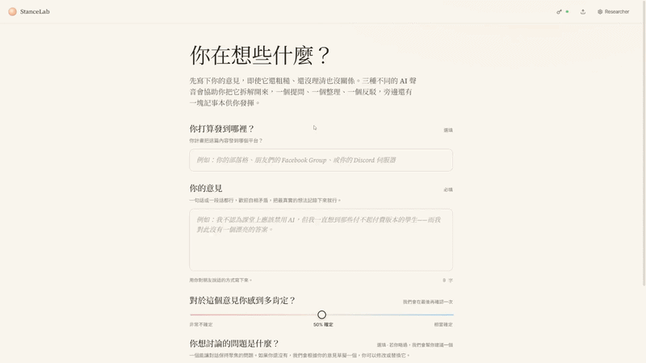
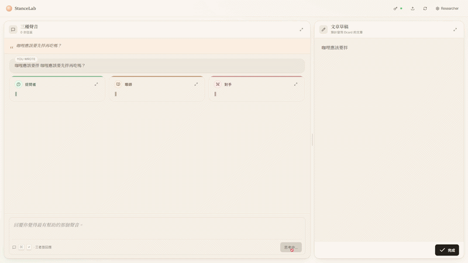
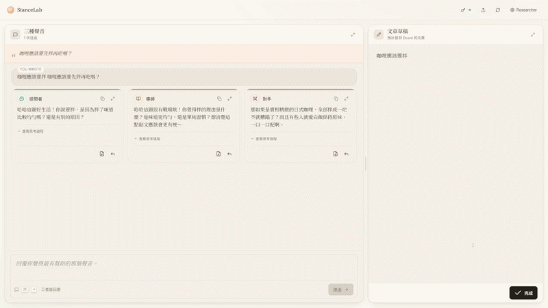

# StanceLab

StanceLab is a web prototype for turning an initial reaction into a clearer,
discussion-ready stance. It gives the user a focused workspace where they can
write an opinion, talk through it with AI support, collect useful points, and
finish with a short draft they can revise or share elsewhere.

The current interface and default prompts are written in Traditional Chinese.
The codebase is a SvelteKit application built with TypeScript, Vite, Tailwind
CSS, and a Cloudflare adapter.

## Visual Walkthrough

### Setup Flow

Users start by naming the sharing context, writing an initial opinion, rating
their confidence, and choosing or generating an anchor question.



### Persona Conversation

In three-persona mode, the same user turn is answered by the Interviewer,
Mentor, and Opponent so the user can compare clarification, organization, and
challenge in one workspace.



### Final Output

The conversation stays paired with a notepad, so reflection can become a draft
that the user edits, reviews, copies, or exports.



## What It Does

StanceLab is designed around stance preparation rather than one-shot post
generation. The app helps a user:

- capture a rough opinion before it is polished;
- define the intended sharing context or audience;
- anchor the conversation around a focused question;
- reflect with either three AI personas or one standalone AI partner;
- move useful responses into a draft notepad;
- export the final draft as text;
- export and later import the full session as JSON.

## Interaction Modes

### Three Personas

In the default mode, each user message is sent to three role-specific AI
personas in parallel:

- Interviewer: asks focused, non-leading questions that clarify meaning,
  context, and assumptions.
- Mentor: organizes reasoning and suggests one concrete way to strengthen the
  stance.
- Opponent: pressure-tests the stance by surfacing objections, edge cases, or
  weak assumptions.

Each persona has its own editable system prompt. The prompt settings are
available from the settings drawer and apply to the next message.

### Standalone LLM

Standalone mode replaces the three parallel responses with a single
conversational partner. This is useful when the user wants a simpler linear
conversation or wants to compare the multi-persona workflow against a standard
chatbot-style workflow.

## User Flow

1. Start with an opinion.
   The user writes a rough stance, optionally adds where they plan to share it,
   and rates how confident they currently feel.

2. Set an anchor question.
   The user can write a question manually or ask the app to suggest one from
   the initial opinion.

3. Reflect in the workspace.
   The workspace has a conversation pane and a draft pane. In persona mode, all
   three personas respond to each turn. In standalone mode, one LLM response is
   shown.

4. Collect material into the notepad.
   Useful AI responses can be quoted into the notepad, and the user can freely
   rewrite the draft beside the conversation.

5. Finish and export.
   The completion screen shows the final draft, asks for a second confidence
   rating, and offers text and JSON export.

## Features

- Bring-your-own-key API access for OpenRouter and OpenCode Go.
- Model picker with suggested models for each provider.
- Streaming chat responses.
- Demo mode with scripted responses when no API key is available.
- Editable persona prompts and standalone system prompt.
- Retry controls for failed or unsatisfactory AI responses.
- Resizable split workspace with fullscreen conversation or notepad panes.
- Markdown rendering for AI responses.
- Session export/import for review or continuation.
- Client-side settings persistence through `localStorage`.

## Architecture

```text
src/
  lib/
    components/        Svelte UI components for setup, chat, notes, settings, import, and completion
    data/personas.ts   Persona definitions, default prompts, demo responses, and shared types
    stores/            Client-side settings store for mode, provider, model, prompts, and API key
    openrouter.ts      Chat-completions client, streaming parser, and response parsing helpers
  routes/
    +page.svelte       Main application state machine and workflow orchestration
    api/opencode-go/   Server-side proxy for OpenCode Go chat requests
```

The app has three main client states:

- `start`: collects the initial opinion, posting destination, anchor question,
  confidence, and feeling tags.
- `workspace`: runs the AI conversation and notepad side by side.
- `complete`: presents the final draft, post-session confidence slider, and
  export actions.

There is no application database. Conversation state lives in browser memory
while the app is open. Settings are stored in `localStorage`, and session data
is only saved when the user exports a JSON file.

## API Providers

StanceLab uses chat-completions-compatible APIs.

### OpenRouter

OpenRouter requests are sent directly from the browser to:

```text
https://openrouter.ai/api/v1/chat/completions
```

The request includes the configured model, messages, token limit, temperature,
and streaming flag. The browser also sends the `HTTP-Referer` and `X-Title`
headers expected by OpenRouter.

### OpenCode Go

OpenCode Go requests are forwarded through the SvelteKit endpoint at:

```text
/api/opencode-go/chat
```

The endpoint proxies requests to:

```text
https://opencode.ai/zen/go/v1/chat/completions
```

This proxy exists because OpenCode Go is not called browser-directly in this
app. The user's authorization header is forwarded to the upstream API.

## Data and Privacy Notes

- API keys are stored only in the current browser's `localStorage`.
- API keys are not included in exported session JSON.
- Conversation turns, prompts, model name, notepad text, confidence values, and
  timestamp are included in exported session JSON.
- Draft text is not uploaded to this app's own backend because there is no
  database or server-side session store.
- Messages are sent to the selected AI provider when the user uses live API
  mode. Use demo mode to explore the interface without sending messages to an
  external model provider.

## Getting Started

Install dependencies with pnpm:

```sh
pnpm install
```

Start the local development server:

```sh
pnpm dev
```

Open the URL printed by Vite, usually:

```text
http://localhost:5173
```

Run Svelte and TypeScript checks:

```sh
pnpm check
```

Run formatting and lint checks:

```sh
pnpm lint
```

Format the codebase:

```sh
pnpm format
```

Build the production app:

```sh
pnpm build
```

Preview the production build locally:

```sh
pnpm preview
```

## Cloudflare Deployment

This project uses `@sveltejs/adapter-cloudflare` and includes a
`wrangler.jsonc` file.

Generate Cloudflare worker types if needed:

```sh
pnpm cf-typegen
```

Preview with Wrangler:

```sh
pnpm preview:cf
```

Deploy with Wrangler:

```sh
pnpm deploy
```

If you deploy your own fork, review `wrangler.jsonc` first and update the
Cloudflare worker name for your account.

## Project Scripts

| Command           | Description                                       |
| ----------------- | ------------------------------------------------- |
| `pnpm dev`        | Start the Vite development server.                |
| `pnpm build`      | Build the SvelteKit app.                          |
| `pnpm preview`    | Preview the production build locally.             |
| `pnpm preview:cf` | Build and preview with Wrangler.                  |
| `pnpm deploy`     | Build and deploy with Wrangler.                   |
| `pnpm check`      | Run SvelteKit sync and `svelte-check`.            |
| `pnpm lint`       | Run Prettier check and ESLint.                    |
| `pnpm format`     | Format files with Prettier.                       |
| `pnpm cf-typegen` | Generate Cloudflare environment type definitions. |

## License

MIT License. See [LICENSE](LICENSE).
